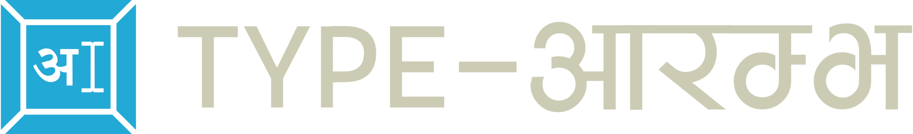
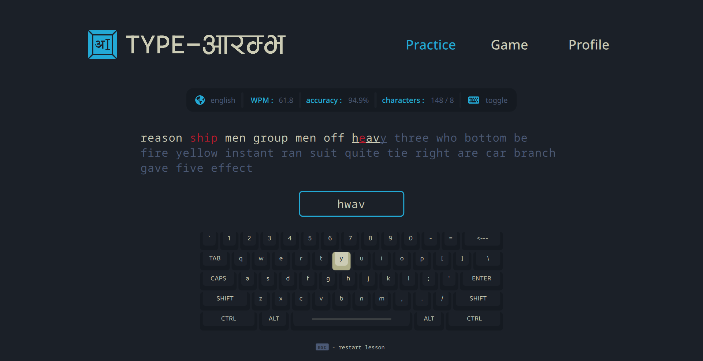
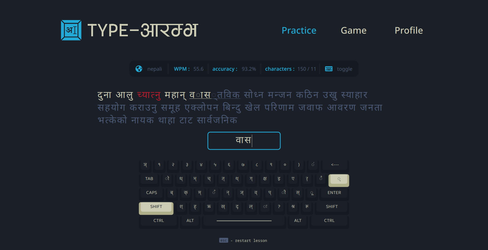
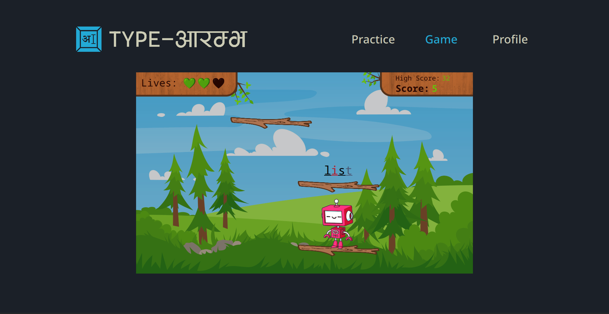
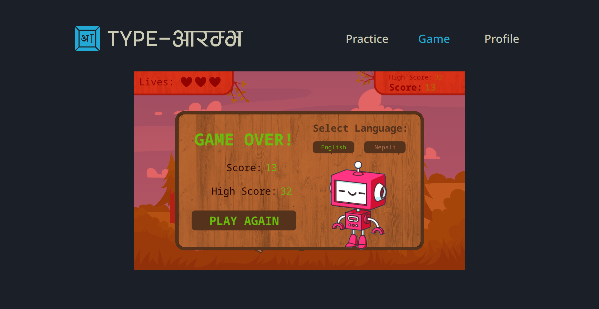

 

“Type-Aarambha” is program that provides a platform, especially to the people of Nepal
to practice their typing skills in both **English** and **Nepali** languages. It includes a well-crafted game that not just entertains the user but also makes them proficient in both
the scripts.

As the name “Type-Aarambha” suggests, this program helps kickstart a person’s journey
of learning to express themselves through the keyboard.

# Build and Run

On Windows 7 and above :

- Download Qt 6 or above with qml, qtquick and charts modules from the Qt website [https://www.qt.io/download-qt-installer](https://www.qt.io/download-qt-installer).

- Open project file `TypeArrambha.pro` in QtCreator and click Run.

# Overview

### Practice Mode

Users can use this mode to learn to type as well as to test their typing speeds. It provides users a curated set of words with keyboard hints to type in both **English** and **Nepali** languages.

 

 

### Game Mode

In this mode, users indulge in a highly engaging and entertaining game that subconsciously helps make their typing better in both **English** and **Nepali** languages.

 

 

### Profile Section

The profile page serves as a comprehensive record of a user's typing performance and progress. Users can access detailed insights into their typing journey, including metrics such as words per minute (WPM), accuracy, and completion times for each typing set they've undertaken. 

# The Team

- [Swastik Aryal](https://www.github.com/octokatherine)
- [Sakshi K.C.](https://www.github.com/octokatherine)
- [Rikesh Panta](https://www.github.com/octokatherine)
- [Neer Aryan Bhatta](https://www.github.com/octokatherine)

